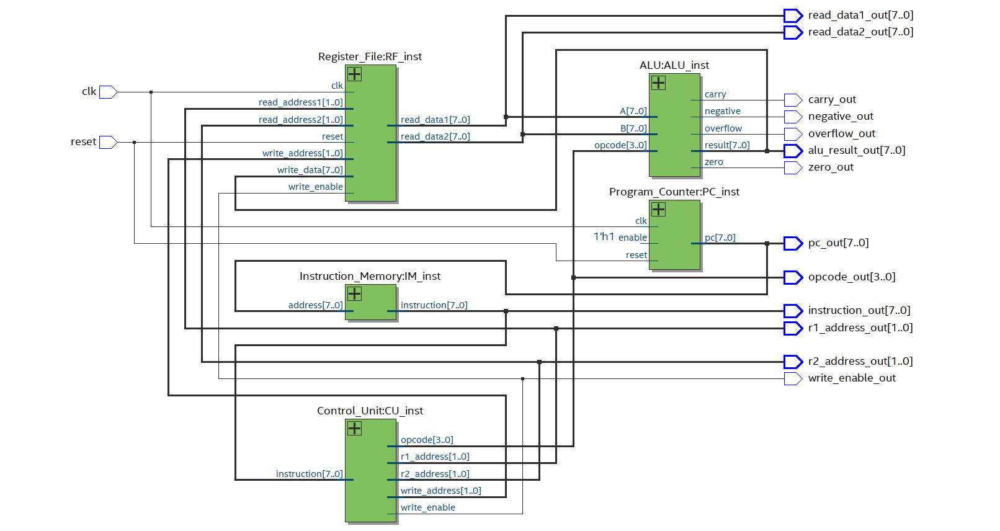
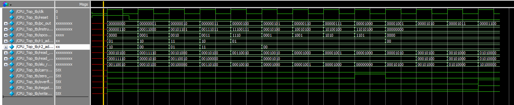

# 8-Bit CPU Design using Verilog HDL

A modular **8-bit CPU** designed and implemented using **Verilog HDL**. The processor follows a simple **Fetch → Decode → Execute → Write Back** architecture and has been functionally verified in **ModelSim** and synthesized using **Intel Quartus Prime**.

---

## Project Overview

This project demonstrates the design of a simple 8-bit processor using modular RTL design techniques.

The processor consists of:

- Program Counter (PC)
- Instruction Memory
- Control Unit
- Register File
- Arithmetic Logic Unit (ALU)
- CPU Top Module

The CPU executes instructions stored in `program.mem` and performs arithmetic and logical operations on a 4-register register file.

---

# CPU Architecture

> Add your architecture diagram here.


---

# RTL Viewer

RTL generated using Intel Quartus Prime.



---

# ModelSim Simulation

Functional verification performed using ModelSim.



---

# Processor Workflow

```
        Reset
          │
          ▼
 Program Counter
          │
          ▼
 Instruction Memory
          │
          ▼
   Control Unit
          │
          ▼
   Register File
          │
          ▼
        ALU
          │
          ▼
     Write Back
          │
          ▼
 Next Instruction
```

---

# Module Description

### Program Counter

- Holds the address of the next instruction.
- Increments every clock cycle.

### Instruction Memory

- Stores program instructions.
- Outputs instruction based on PC address.

### Control Unit

- Decodes the instruction.
- Extracts:
  - Opcode
  - Register Address 1
  - Register Address 2
  - Write Enable

### Register File

- Four 8-bit registers
- Two asynchronous read ports
- One synchronous write port

### ALU

Supports:

- ADD
- SUB
- AND
- OR
- XOR
- PASS A
- PASS B

Also generates:

- Carry Flag
- Zero Flag
- Negative Flag
- Overflow Flag

---

# Instruction Format

| Bits | Description |
|------|-------------|
| 7:4 | Opcode |
| 3:2 | Register 1 (Read/Write) |
| 1:0 | Register 2 (Read) |

---

# Project Directory

```
RTL/
Testbench/
Programs/
Images/
README.md
LICENSE
```

---

# Tools Used

- Verilog HDL
- ModelSim
- Intel Quartus Prime Lite 20.1

---

# Verification

✔ Functional Simulation using ModelSim

✔ RTL Analysis using Quartus Prime

✔ RTL Viewer Generated

✔ Full Compilation Successful

---

# Future Improvements

- Immediate Instructions
- Data Memory
- Branch Instructions
- Jump Instructions
- Separate Destination Register
- Pipelined CPU

---

# Author

**Thej Krishna P.R**

B.Tech Electronics and Communication Engineering

RTL Design | Verilog HDL | VLSI Enthusiast
